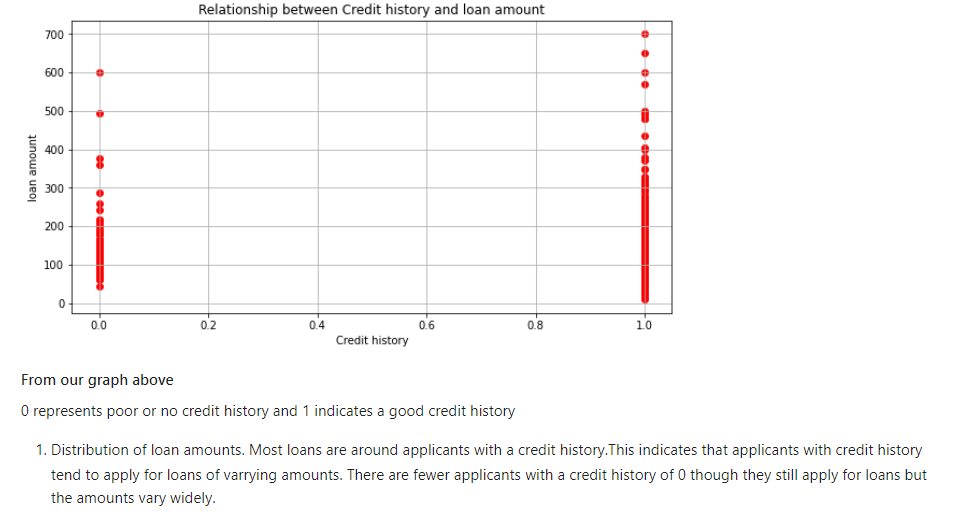
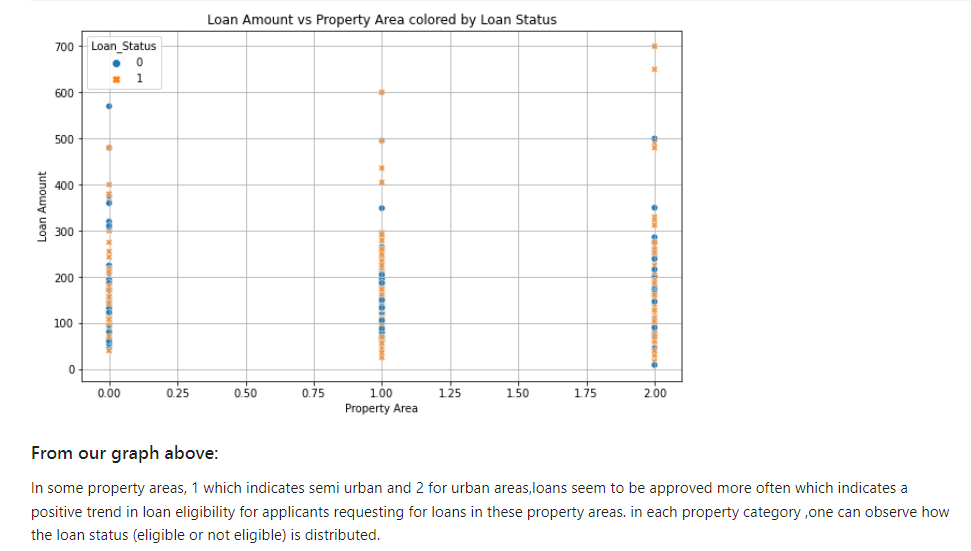

# Prediction_of_Loan_Approval

**Problem Statement:**
Dream Housing Finance company deals in all home loans. They have a presence across all urban, semi-urban, and rural areas. Customer-
first applies for a home loan after that company validates the customer eligibility for a loan.
The company wants to automate the loan eligibility process (real-time) based on customer detail provided while filling the online
application form. These details are Gender, Marital Status, Education, Number of Dependents, Income, Loan Amount, Credit History, and
others. To automate this process, they have given a problem to identify the customer's segments, those are eligible for loan amount so that
they can specifically target these customers.

 **Data Understanding:**
Features: Analyze the features like Gender, Marital Status, Education, Number of Dependents, Income, Loan Amount, Credit History, etc.
Target Variable: The target variable is likely the loan eligibility status (e.g., eligible or not eligible)

**Techniques Involved:**
1. Data Preprocessing:
1. Handle Missing Values: Check for any missing values and decide how to handle them (e.g., filling in, discarding).
**Encoding Categorical Variables:** Convert categorical variables (e.g., Gender, Marital Status) into numerical formats using techniques like
one-hot encoding or label encoding.
 Feature Scaling: Scale features like Income, Loan Amount to ensure they're on the same scale.
**Exploratory Data Analysis (EDA):**
1. Correlation Analysis: Check correlations between features and the target variable to identify key predictors.
2. Visualizations: Use visualizations (e.g., histograms, box plots) to understand the distribution of features and their relationship with the
target variable.
**Model Selection:**
Choose appropriate classification models, such as: Logistic Regression: Simple and interpretable.
1. Train the model(fit the training datasets)
2. Predict the model
3. Deploy the model

**Examples of some visualisations**

**Recommendations**
1. Targeted Outreach:
Based on the identified segments, develop targeted marketing strategies. For example, if high-income individuals with good credit history
are more likely to be approved, tailor marketing efforts towards this segment.
2. Bias and Fairness Review:
Regularly review and audit the automated system to ensure it is fair and unbiased. Ensure compliance with legal and ethical standards,
particularly regarding gender and other sensitive attributes.
3. Segment Identification:
Gender: Identify if certain genders are more likely to be approved for loans. Ensure to consider this in a fair and unbiased manner, ensuring
compliance with regulations.
Applicant Income: Segment applicants based on their income levels to determine which income brackets are more likely to receive loans.
Higher income has indicated higher loan eligibility.
Credit History: Focus on applicants with good credit history as they are more likely to be eligible for loans. Create segments based on credit
scores or history.
**Conclusion**
By focusing on Gender, Applicant Income, and Credit History, Dream Housing Finance can effectively streamline their loan eligibility
process. The recommendation is to use machine learning models to identify and validate these factors' impact on loan approvals.
Implementing a targeted approach based on these insights will enhance efficiency and accuracy in loan processing while ensuring fair and
unbiased decision-making. Regularly updating the system and reviewing for biases will ensure long-term effectiveness and compliance.